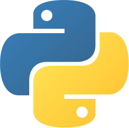

# CURSO DE PYTHON POR OLIVERGR

## Instalación de Python
Visista el siguiente enlace para instalar python:
[Python](https://www.python.org/downloads/)  

## Ejecuta los archivos con   
*python + nombreDelFichero*

En unas versiones de python 3.x, se puede ejecutar 
el archivo con el comando:
*python3 + nombreDelFichero*

## ¿Por dónde empieza?  
El siguiente sistema de archivos y directorios esta 
pensado para que el usuario pueda  
empezar a aprender a programar en python de forma ordenada.  

**src/**  
*/vars.py*  

**src/types**  
*/dataTypes.py*  
*/numbers.py*  
*/strings.py*  
*/list.py*  
*/set.py*  
*/tuples.py*  
*/dictionaries.py*  

**src/loops**  
*/for.py*  
*/while.py*  

**src/functions**  
*/defStatement.py*  
*/lambda.py*  

**src/enter**  
*/enter.py*  

## ¿Se sienete preparado para el siguiente paso?  
Puede revisar la carpeta **src/exercises** para ver los ejercicios que estare subiendo  
con frecuencia, también lo invito a que desarrolle sus propios ejercicios y me mande  
un pull request para que de ese modo usted aprenda más y comparta sus conocimientos.

